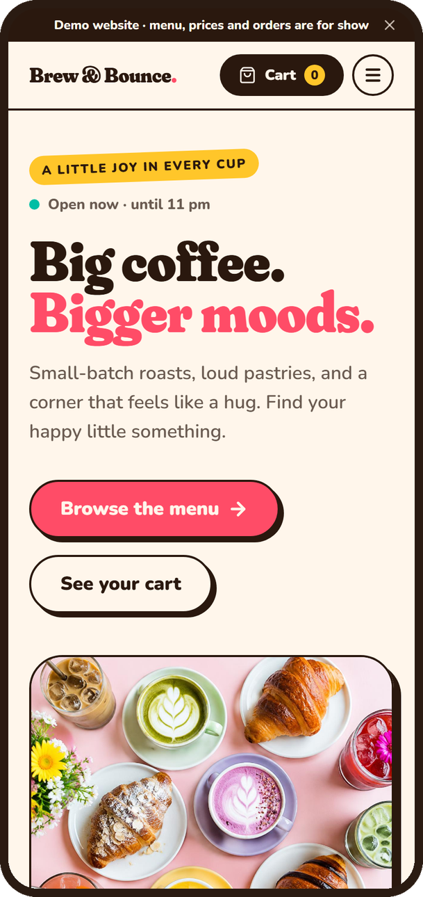
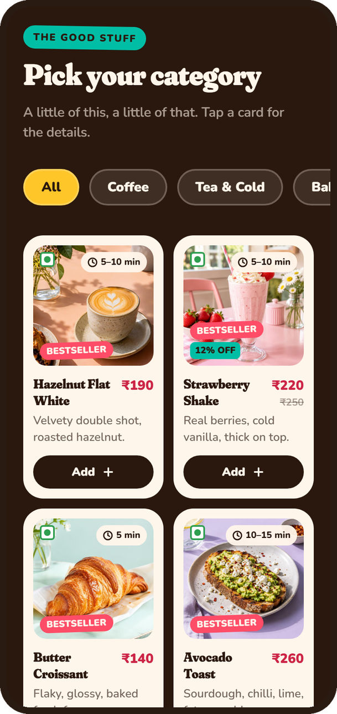
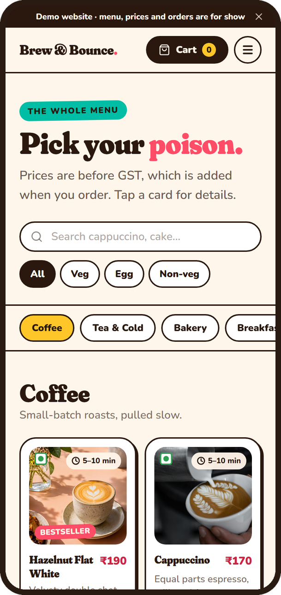
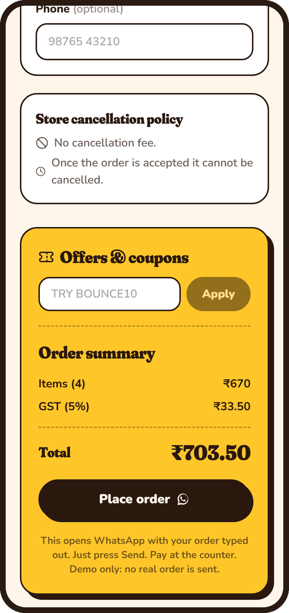
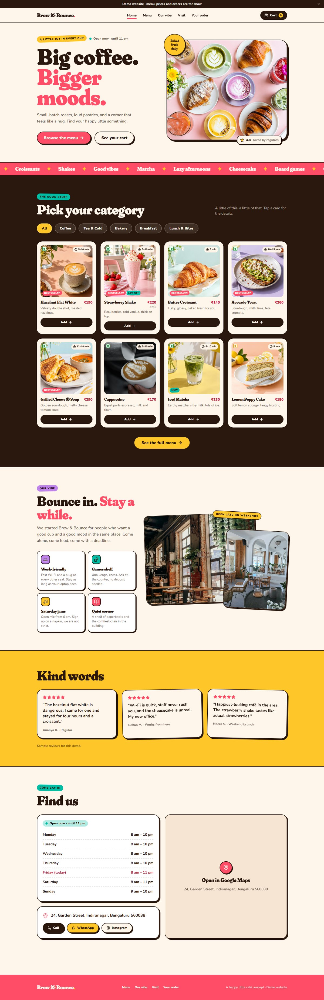
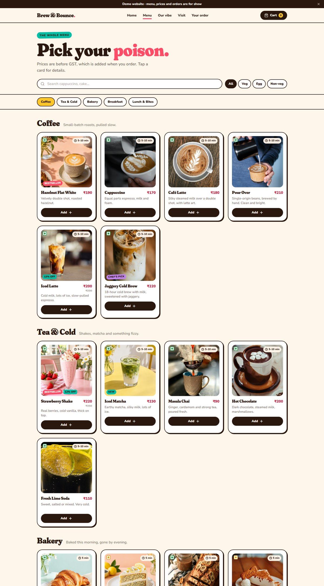
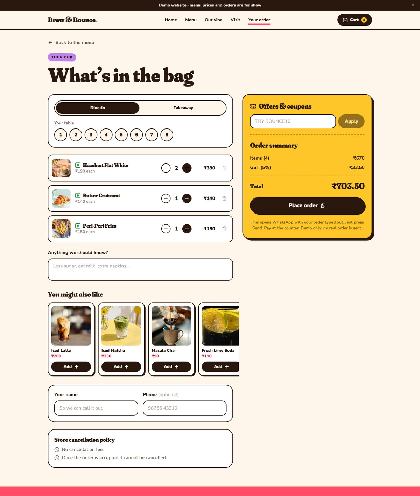

# Brew & Bounce: café website + ordering demo

A mobile-first website for a playful café in Bengaluru. Customers browse the menu, add drinks and bites to their order, and send it to the café on **WhatsApp**. No backend, no database and no monthly cost.

> **Design preview.** Brew & Bounce is a fictional brand. The café name, address, phone number, reviews and rating are placeholders, made to show a local café what its own site could look like.

### 🔗 Live demo: [brew-and-bounce.vercel.app](https://brew-and-bounce.vercel.app/)

Best viewed on a phone, but it works on desktop too.

---

## About

A demo café site built to show local shops what a modern website with online ordering could look like for them. Everything runs in the browser, so there is no server to pay for.
The look comes from the Brew & Bounce mock (cream, espresso, berry, citrus, teal and grape; Fraunces + Nunito; chunky offset shadows), and the order flow borrows ideas from delivery apps.

## Features

- **Menu:** 28 items in ₹ across 5 categories, with search, veg / egg / non-veg filters, bestseller and discount tags, and a detail sheet for each item
- **Cart and order:** floating cart bar, dine-in table picker or takeaway, notes, "you might also like", coupons, 5% GST breakdown
- **WhatsApp hand-off:** *Place order* opens WhatsApp to the shop with the whole order typed out; the guest just presses Send
- **A café with personality:** hangout vibe section, reviews, live "Open now" from the opening hours, map with an "Open in Google Maps" fallback
- **Mobile first:** works on phones, tablets and desktop, respects reduced-motion, keyboard friendly
- **Easy to reuse:** one config file, one menu file, one set of colour tokens

## Screenshots

### Phone

<table>
  <tr>
    <td align="center"><br><sub><b>Home</b></sub></td>
    <td align="center"><br><sub><b>Pick a category</b></sub></td>
    <td align="center"><br><sub><b>Full menu</b></sub></td>
    <td align="center"><br><sub><b>Order &amp; WhatsApp</b></sub></td>
  </tr>
</table>

### Desktop



<table>
  <tr>
    <td align="center"><br><sub><b>Menu</b></sub></td>
    <td align="center"><br><sub><b>Your order</b></sub></td>
  </tr>
</table>

## Run

```bash
npm install
npm run dev      # http://localhost:5173
npm run build    # outputs /dist
```

## How an order reaches the shop (free, no backend)

Tapping **Place order** saves the order on the guest's device and opens WhatsApp to the shop's number with the whole order typed out.
The guest only presses Send. This uses a free `wa.me` link: no account, API or fees. A text message cannot carry an attached PDF or image.

Want it automatic? Later options, all free to start: a Telegram bot through a Netlify function, a Google Sheet through Apps Script,
or a live kitchen screen with Supabase / Firebase. Only `submitOrder()` in `src/lib/orders.js` needs to change.

## Reuse for another shop (about an hour)

1. `src/config/cafe.js`: name, phone, WhatsApp number, address, map, hours, tables, tax, coupons, demo banner
2. `src/data/menu.js`: categories, items, prices (₹), veg / egg / non-veg, tags, old prices
3. `public/images`: swap the photos (keep names or edit the `image` paths)
4. `src/index.css`: colours and fonts live in the `@theme` block at the top
5. `src/components/Sections.jsx`: the vibe and reviews copy (**sample text, replace with the real shop's**)

Set `demoMode: false` and `whatsappOrders: true/false` in `cafe.js` to hide the demo banner or switch the WhatsApp step off.

## Table QR codes

Link each table's QR code to `https://your-site/?table=4`; the order page will pre-select that table.

## Deploy

Netlify or Vercel, both free. Build command `npm run build`, publish directory `dist`.

## Notes

- Prices are shown before GST; 5% is added at checkout.
- Demo coupons: `BOUNCE10` (10% off), `FIRSTSIP` (₹50 off above ₹300).
- Photos: Unsplash (free to use) and the mock's artwork. Use the shop's own photos for a real client.
- Phone numbers, address, reviews and the 4.8 rating are placeholders.
